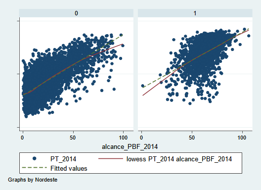
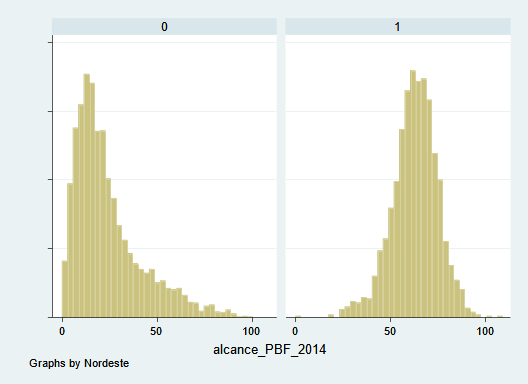

```{r setup, include=FALSE}
knitr::opts_chunk$set(message=FALSE, warning = FALSE)
```

```{r message=FALSE, warning=FALSE, include=FALSE}
#install.packages("sjPlot")
#install.packages("sjmisc")
library(sjPlot)
library(sjmisc)
library(tidyverse)
library(tidylog)
library(stargazer)
library(readxl)
library(lmtest)
library(olsrr)
library(corrplot)
library(broom)
```

Para realizar esta lista de exercícios, considere a base da dados que está no Moodle. Esta é uma base com dados reais, com os resultados das eleições nacionais de 2010 e 2014 – a mesma da semana passada.

```{r message=FALSE, warning=FALSE, include=FALSE}
base <- read_excel("base_lab_06.xlsx")

head(base)

```


O banco nos permite responder a questão sobre o que explicou o voto no PT no ano de 2014 (PT_2014). 

A unidade de análise é a votação por município. Então, 5572 observações. Há, como variáveis explicativas:
  * o voto no partido em 2010 (PT_2010); 
  * a população das cidades, tanto em nível (pop2014), quanto em logaritmo (ln_pop_2014); 
  * a porcentagem de famílias da cidade que recebem o bolsa família em 2014 (alcance_PBF_2014);
  * e uma dummy que indica se a cidade está na região Nordeste do país ou não (Nordeste). 


```{r message=FALSE, warning=FALSE, include=FALSE}
base_2 <- 
  base %>% 
  mutate(dummy_nordeste = case_when(Nordeste %in% 0 ~ 0,
                     Nordeste %in% 1 ~ 1)) %>% 
  mutate(logpop2014 = log(pop2014, base = exp(1)))

head(base_2)
```


Inicialmente, precisamos avaliar se as variáveis explicativas se adequariam a um modelo linear em relação á variável resposta (PT_2014). Para isto, vamos lançar mão de gráficos que nos ajudarão a tomar essa decisão.

Usando o comando a seguir, construa gráficos de dispersão para cada um dos pares de variáveis, alterando a variável x (marcada em vermelho). 

```{r echo=FALSE, message=FALSE, warning=FALSE}
base_2 %>% 
  ggplot() +
  aes(x = PT_2010, y = PT_2014) +
  geom_point() +
  stat_smooth(method='lm') +
  ggtitle("Dispersão entre as variáveis votos no PT em 2010 e em 2014")
```


```{r echo=FALSE, message=FALSE, warning=FALSE}
base_2 %>% 
  ggplot() +
  aes(x = pop2014, y = PT_2014) +
  geom_point() +
  stat_smooth(method='lm') +
  ggtitle("Dispersão entre as variáveis população em 2014 e votos no PT em 2014")
```

```{r echo=FALSE, message=FALSE, warning=FALSE}
base_2 %>% 
  ggplot() +
  aes(x = logpop2014, y = PT_2014) +
  geom_point() +
  stat_smooth(method='lm') +
  ggtitle("Dispersão entre as variáveis log de população em 2014 e votos no PT em 2014")
```

```{r echo=FALSE, message=FALSE, warning=FALSE}
base_2 %>% 
  ggplot() +
  aes(x = alcance_PBF_2014, y = PT_2014) +
  geom_point() +
  stat_smooth(method='lm') +
  ggtitle("Dispersão entre as variáveis porcentagem que recebe BF em 2014 e votos no PT em 2014")
```


1. Discuta a adequação do modelo linear para cada variável. Determine, assim, as variáveis que entrarão no modelo e sua especificação.
    
*Modelos lineares assumem que a relação entre duas variáveis é constante ao longo de todos os intervalos, isto é, tem uma relação que pode ser representada por $\alpha + \beta X$. A partir dos gráficos de dispersão, podemos vizualizar uma relação linear entre a variável votos no PT em 2014 e as variáveis votos no PT em 2010, e porcentagem da população que recebe o Bolsa Família. A relação entre votos no PT em 2014 e o log da população parece ter uma relação linear, porém com correlação baixa.*
    
    
```{r echo=FALSE, message=FALSE, warning=FALSE, paged.print=TRUE}

base_2_menos_muni <- 
  base_2 %>% 
  select(pop2014, alcance_PBF_2014, PT_2010, PT_2014, dummy_nordeste) %>% 
  rename(PBF_2014 = alcance_PBF_2014,
         nord = dummy_nordeste)

corrplot(cor(base_2_menos_muni), 
    method = "number")
```

  
    
2. Se rodássemos um modelo bivariado apenas com a variável transformada, como interpretaríamos o coeficiente deste modelo?
    
```{r message=FALSE, warning=FALSE, include=FALSE}

modelo_bi_PT_2010 <- 
  base_2 %>% 
  lm(PT_2014 ~ PT_2010, data=.)
  
modelo_bi_bolsa_familia <- 
  base_2 %>% 
  lm(PT_2014 ~ alcance_PBF_2014, data=.)

modelo_bi_pop <- 
  base_2 %>% 
  lm(PT_2014 ~ pop2014, data =.)

#modelo_bi_logpop <- 
  #base_2 %>% 
  #lm(PT_2014 ~ logpop2014, data =.)

modelo_bi_nordeste <- 
  base_2 %>% 
  lm(PT_2014 ~ dummy_nordeste, data=.)
```


```{r echo=FALSE, message=FALSE, warning=FALSE, paged.print=FALSE, results="asis"}
stargazer(modelo_bi_PT_2010, 
          modelo_bi_bolsa_familia, 
          header = FALSE,
          digits =  4,
          type = "html")
```

```{r echo=FALSE, message=FALSE, warning=FALSE, paged.print=FALSE, results="asis"}
stargazer(modelo_bi_pop,
          modelo_bi_nordeste, 
          header = FALSE,
          digits =  4,
          type = "html")
```
  
        
*Nos modelos bivariados, todas as variáveis se mostraram estatísticamente significantes ao nível de 95%. O modelo com o maior $R^{2}$ foi o modelo com os votos no PT em 2010, com um $R^{2}=0.79$, e o modelo com o alcance do Bolsa Família em 2014, com um $R^{2}=0.66$.*
     
     
Vamos agora rodar o modelo com a variável transformada mais todas as demais variáveis apresentadas.


```{r message=FALSE, warning=FALSE, include=FALSE}
modelo_completo <- 
  base_2 %>% 
  lm(PT_2014 ~ PT_2010 + alcance_PBF_2014 + pop2014 + dummy_nordeste, data=.)
```

```{r echo=FALSE, message=FALSE, warning=FALSE, paged.print=FALSE, results="asis"}
stargazer(modelo_completo,
          header = FALSE,
          digits =  4,
          type = "html")
```
  


3. Apresente os resultados da regressão. Interprete os parâmetros estimados.   

*No modelo multivariado, todas as variáveis se mantiveram sigificantes. No entanto, a dummy nordeste, que no modelo bivariado tinha significância ao nível de 95%, teve significância diminuída. O $R^{2}$ aumentou para 0.84 *
    
    
De acordo com a visão convencional, inclusive do senso comum, o bolsa família teve muita influência na eleição e ainda mais nas cidades nordestina. Lá, os efeitos se reforçaram, dando ainda mais vantagem para o Partido dos Trabalhadores.

4. A partir do modelo rodado anteriormente, altere a especificação e forma a contemplar este entendimento. Apresente os resultados do modelo. 

*Nessa ideia temos uma hipótese condicional. Temos a variável Y de interesse os votos no PT em 2014 (PT_2014). Como variável independente X, contínua, temos o alcance do Bolsa Família (alcance_PBF_2014). No entanto, estamos expressando nessa hipótese que a variável dummy Nordeste exerce um efeito no modo como $X\to Y$. Isto é, quando a variável dummy_nordeste $Z=1$, esperamos que X cause um aumento mais expressivo em Y do que quando a $Z=0$. Podemos expressar em termos de equação da seguinte forma:*

$$Y = \beta _{0} + \beta _{1}X + \beta _{2}Z + \beta _{12}XZ+\varepsilon $$

*Em que $\beta _{2}Z + \beta _{12}XZ$ testa se há relação interativa entre X e Z*.

```{r message=FALSE, warning=FALSE, include=FALSE}
modelo_interativo <- 
  base_2 %>% 
  lm(PT_2014 ~ alcance_PBF_2014:dummy_nordeste, data=.)


modelo_interativo2 <- 
  base_2 %>% 
  lm(PT_2014 ~ alcance_PBF_2014 + dummy_nordeste + alcance_PBF_2014:dummy_nordeste, data=.)


```

```{r echo=FALSE, message=FALSE, warning=FALSE, paged.print=FALSE, results="asis"}
stargazer(modelo_bi_bolsa_familia,
          modelo_bi_nordeste,
          modelo_interativo2,
          header = FALSE,
          digits =  4,
          type = "html")
```

*No modelo interativo, o termo continua com significância estatística, e exerce um efeito positivo no votos no PT. Porém, de acordo com nossa hipótese, esperaríamos que o alcance do PBF nas cidades nordestinas exercesse um efeito maior do que em cidades fora do Nordeste. Vemos que o termo interativo tem significância ao nível de p<0.1, e tem sinal negativo, tendo ainda, magnitude menor do que o termo da variável do PBF em que a cidade não está no Nordeste.* 

*Pela magnitude do termo, vemos que isso não se concretizou. O $\beta _{1}X=0.57$ indica a influência da variável X quando $Z=0$, ou seja, do PBF quando a cidade não está no Nordeste. Enquanto o $\beta _{12}XZ=-0.04$ indica a influência da variável X quando $Z=1$.*

5. Construa um gráfico que mostre os efeitos marginais destes novos termos introduzidos. em que modelo é o rótulo do objeto onde você registrou os resultados da regressão; variável contínua é a variável explicativa contínua e a variável dummy é a variável explicativa dummy utilizadas no modelo.

```{r echo=FALSE, message=FALSE, warning=FALSE}
plot_model(modelo_interativo2, type = "pred", terms =c("alcance_PBF_2014", "dummy_nordeste"))
```

6. Interprete seu gráfico, comparando-o com os resultados da regressão que você obteve no item 4).

*Com o modelo interativo, vemos que há duas retas de regressão, ou seja, não é como nos modelos aditivos, no modelo interativo cada reta tem um $\beta_{0}$ diferente. Percebe-se que a reta da regressão em que a cidade está no Nordeste tem uma inclinação levemente maior do que a da cidade que não está no Nordeste, indicando que realmente, a cidade estar no Nordeste exerce influência sobre voto no PT.*

Para realizar esta segunda discussão, não haverá exercício propriamente dito. Vamos testar as críticas de Hainmueller, Mummolo e Xu (2019), implementando seus comandos sugeridos, em relação à base que utilizamos aula passada. A ideia é reavaliarmos se nossos resultados obtidos se sustentam com a crítica feita por eles a trabalhos que utilizam modelos interativos.

Suponha, então, que tenhamos o mesmo modelo da aula passada, que é algo um pouco fora do usual quando se pensa um experimento: a cidade estar no Nordeste é o tratamento e a cobertura do Bolsa Família, a variável moderadora. Isto não é preciso do ponto de vista metodológico porque o tratamento precisaria ser aleatório e no caso não é. Fazemos isso pelo exercício apenas, já que precisaríamos de uma dummy para facilitar a noção de tratamento. Assim, nosso “experimento” aqui é: se alocássemos uma cidade no Nordeste (tratamento), teria ela apresentado uma votação maior para o PT do que uma cidade que está fora do Nordeste (controle)?

1. Observando este gráfico, é possível sabermos se as críticas apontadas por Hainmueller, Mummolo e Xu (2019) se aplicam a este caso? Aponte as duas críticas.
    
*As duas críticas apontadas pelos autores são: se a relação entre as variáveis não é linear, um modelo linear pode ser usado apenas como uma aproximação linear do que seria o modelo real (p.164). A segunda crítica é que é necessário atentar-se se há common support nos dados quando montamos um modelo, isto né, no caso do nosso exemplo, se existe um número suficiente de casos em que Z=0 e Z=1, se não a conclusão que tiramos do nosso modelo é mera extrapolação (p.165).*

A fim de nos certificarmos de se as críticas se aplicam, adotamos a primeira das sugestões feitas pelos autores e sobrepusemos três gráficos: o de dispersão entre alcance do BF (eixo X) e a votação no PT (eixo Y), a regressão linear (Fitted values) e o gráfico de ajuste ponderado (Loess regression). No gráfico abaixo podemos ver os resultados destes gráficos, quando as cidades não são do Nordeste (Nordeste = 0 – gráfico a esquerda) e quando as cidades são do Nordeste (Nordeste = 1 – gráfico a direita).




2. Observando o gráfico acima, quais são suas posições a respeito das críticas dos autores apontadas na resposta 1?

*Com o histograma, podemos ver que a distribuição de cidades em que Nordeste = 0 é assimétrica à esquerda, enquanto a distribuição de cidades em que Nordeste = 1 se assemelha mais a uma distribuição normal.*

```{r message=FALSE, warning=FALSE, include=FALSE}
base_2 %>% 
  ggplot() +
  geom_histogram(aes(x = alcance_PBF_2014)) +
  facet_grid(cols = vars(dummy_nordeste))

```


*Já a respeito dos gráficos de dispersão, vemos que o gráfico para Nordeste=0 aparenta mais seguir uma distribuição logarítimica.*

Ainda seguindo a proposição dos autores, vamos executar a primeira de suas proposições que é a de regressão linear baseada em intervalos (bins). Através desta regressão, teremos condições de confirmar se a relação é mesmo linear ou não. O resultado da regressão é dividido em 3 valores representativos de cada tercil dos dados, e chamado de Baixo (L), Médio (M), Alto (H). É possível também considerar o suporte da variável moderadora. O gráfico abaixo apresenta os resultados:


3. Em termos da linearidade do efeito e da distribuição do suporte, quais conclusões podemos tirar a partir do gráfico acima? Além disso, a inclinação da reta é condizente com o resultado obtido no primeiro gráfico apresentado aqui (encontrado na aula passada)? Por que?

Vamos, então, partir para uma avaliação semi-paramétrica. Esta nos permitirá investigar qualquer suposta não linearidade dos efeitos do município estar no Nordeste (tratamento), moderado pelo alcance do Bolsa Família. O gráfico abaixo apresenta um resultado obtido usando o mesmo comando proposto pelos autores. É um modelo via kernel. O bin aqui é de 10,6, ajuste ótimo calculado pelo próprio modelo.


4. Qual a conclusão podemos tirar do efeito do nosso tratamento sobre a votação para o PT, em termos de linearidade e de suporte da variável moderadora? Em relação ao nosso resultado obtido na aula passada, ele se sustenta? Por que?


# Anotações da aula

## sobre o lab 06

A ideia do lab da semana passada era discutir problemas que podem surgir ao mudar para o modelo interativo.

O efeito de X2 sobre Y depende de X1

Primeiro pressuposto - o efeito de X1 sobre Y é linear, se temos um problema de especificação que pode afetar essa relação, vai afetar tb o efeito de X2 - pode ser que a relação esteja numa formulação matemática que não seja linear

Solução proposta pelos autores é avaliar qual a relação antes de fazer o modelo, **vendo para faixas de valores diferentes** - o efeito pode mudar de uma faixa pra outra, pode não ser constante para todas as faixas de valores (ou seja, não ser linear), implicando numa relação mais complexa.

Estamos apontando que os beneficiários do PBF NO NORDESTE tem uma propensão AINDA MAIOR a votar no PT

O objetivo é vermos se essas coisas são diferentes ou não - isto é, se o modelo interativo, as variáveis interagindo, é diferente das variáveis não interagindo.

Como beta 2 + b3 < b2 então o efeito do PBF é maior fora do Nordeste do que no Nordeste, votam mais fora do nordeste do que no nordeste. 

Se tenho distribuições diferentes é natural que as curvas sejam diferentes, isso pode ter menos a ver com o efeito das variáveis e mais com a distribuição dos dados (ver os histogramas). No ultimo grafico vemos que a relação nao é linear, porque ela muda em cada intervalo. 

